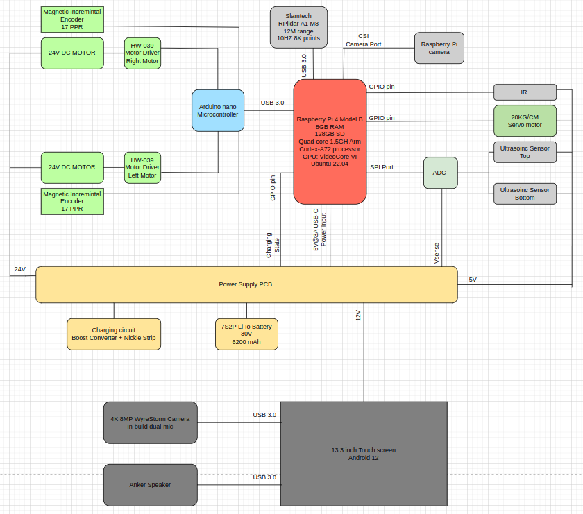
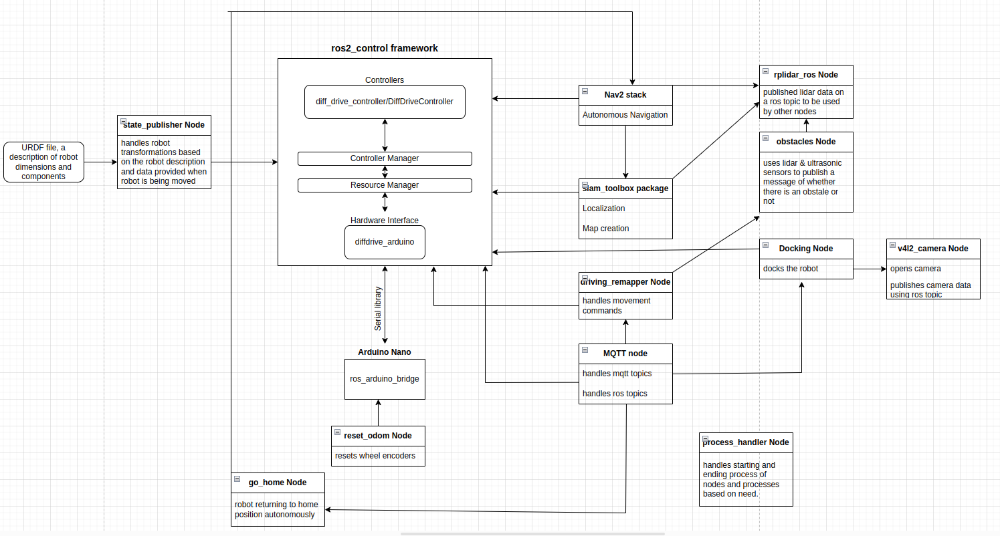

# TEBO 

## Table of Contents

hi from bash file
- [Overview](#overview)
- [Hardware Architecture](#hw_arch)
- [Software Architecture](#sw_arch)
- [Commuincation Via MQTT](#mqtt_pf)

## OVERVIEW 

Tebo is a telepresence robot designed to remove physical boundaries and bring people together in a new way of connectivity. By combining remote control and live video communication, it empowers users to virtually extend themselves to distant locations. 

## HARDWARE ARCHITECTURE 

- **Raspberry Pi 4 Model B** is serving as the central processing unit. It acts as the decision-making hub, leveraging its computational power and connectivity options.
- **Arduino Nano Microcontroller** is connected to the Raspberry Pi via USB 3.0, acts as an intermediary between the Pi and the robot's **motor drivers** and **encoders**. This setup ensures efficient communication and real-time control over motor movements.
- **2D Lidar** enables the robot to sense its environment for obstacle detection, mapping, and navigation.
- A **Camera** linked to the Raspberry Pi enhances the robot's perception, supporting autonomous docking by providing visual feedback.
- **Two Ultrasonic Sensors** connected via an **ADC chip**, offer obstacle detection capability. One sensor scans the robot's bottom area, while the other covers the top area, providing comprehensive sensing coverag.
- An **IR sensor** contributes to the robot's safety by detecting cliffs or drop-offs, helping to prevent potential accidents.
- A **Servo Motor** is connected the Pi that tilts the top-mounted screen. This feature offers a dynamic viewing angle for the users interacting with the robot's screen.
- A **13.3-inch touch screen** running Android 12 provides a user-friendly interface for interaction. It serves as a window to the users video call and initial set up.
- **Anker Speaker and WyreStorm Camera**  enhance communication quality, ensuring clear audio input/output and video conferencing capabilities for an immersive experience.
- **Power Supply PCB** is a custom made PCB efficiently distributing power to various components. It is powered by a **7s2P lithium-ion battery**.
- A **charging circuit** with a boost converter ensures effective battery charging, while a nickel strip enables convenient charging when connected to the docking station.

## SOFTWARE ARCHITECTURE 

### Raspberry pi functionality features

1. Control robot remotely using MQTT communication. Movement commands: forward, rotate left, slide left, rotate right, slide right.
2. Robot can create and save a map of the environment. Its a user-driven mapping where robot maps while moving, user should ensure obstacle-free spaces and open doors.
3. With a saved map, the robot can navigate autonomously to its docking station.
4. Robot autonomously parks into the docking station. If map is provided, it can find its way to the docking area from any location and park autonomously. If not, user can just park it near the dock area and robot can autonomously park itself in the station.
5. Provides feedback on charging state and movement state.
   
### Technology Stack

1. Programming Languages & Platform
   - Python 3.10
   - C++ 11.4
   - Ubuntu 22.04

2. Frameworks & Libraries
   - ROS2 Humble
   - Opencv 4.5.4
   - paho-mqtt
   - rpi.gpio
   - python3-gpiozero
   - libraspberrypi-bin
   - v4l-utils
   - dotenv
   - [Diff_drive Arduino](https://github.com/Buzzology/diffdrive_arduino/tree/3883c00479e2eeaa844ad8ae14fe147ee742ea7d)
   - [Serial](https://github.com/wjwwood/serial)
   - [ros_arduino_bridge](https://github.com/hbrobotics/ros_arduino_bridge)
     
3. ROS packages
   - ros-humble-slam-toolbox
   - ros-humble-rplidar-ros
   - ros-humble-ros2-control 
   - ros-humble-joint-state-publisher-gui
   - ros-humble-navigation2
   - ros-humble-nav2-bringup
   - ros-humble-v4l2-camera
     
### ROS diagram

## COMMUNICATION VIA MQTT 

### TOPIC STRUCTURE

| Topic                          | Usage                                                                |
| ------------------------------ | -------------------------------------------------------------------- |
| Devlacus/Tebo/robotID/move/#   | messages related to movement.                                        |
| Devlacus/Tebo/robotID/info/#   | messages related to information passed between robot and application |
| Devlacus/Tebo/robotID/action/#   | messages related to triggering the robot for an action               |
| Devlacus/Tebo/robotID/config/# | messages related to configuration                                    |

### TOPICS & MESSAGES 

                                          |

